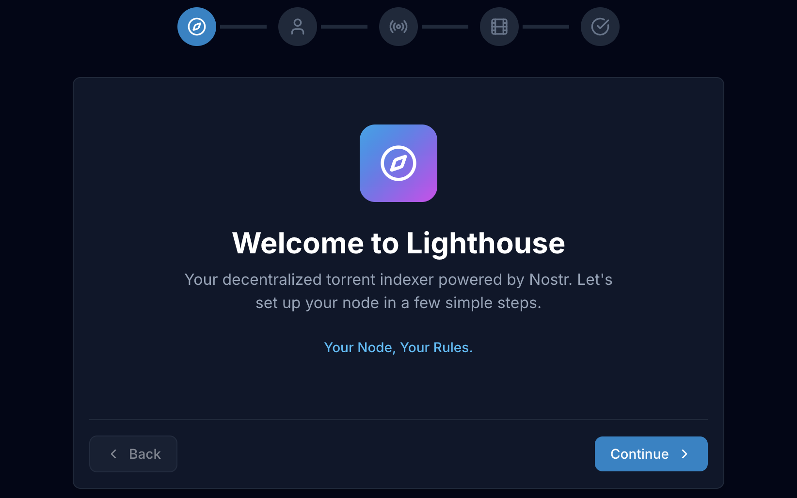
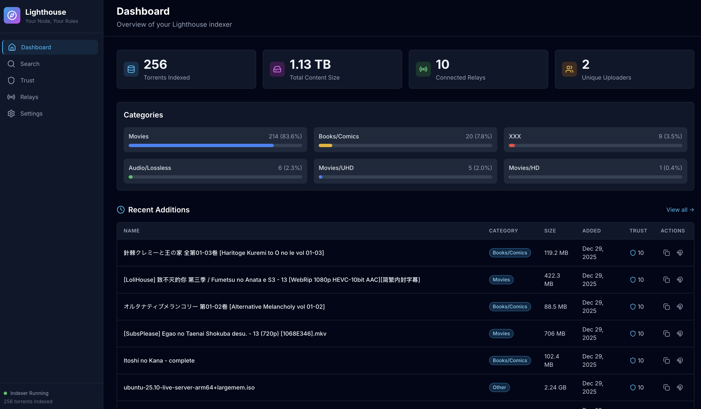
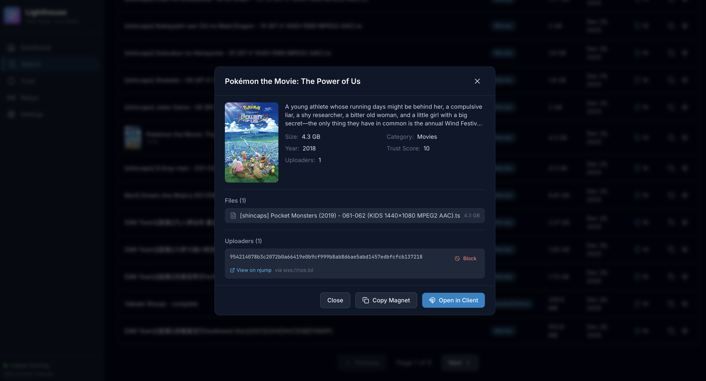
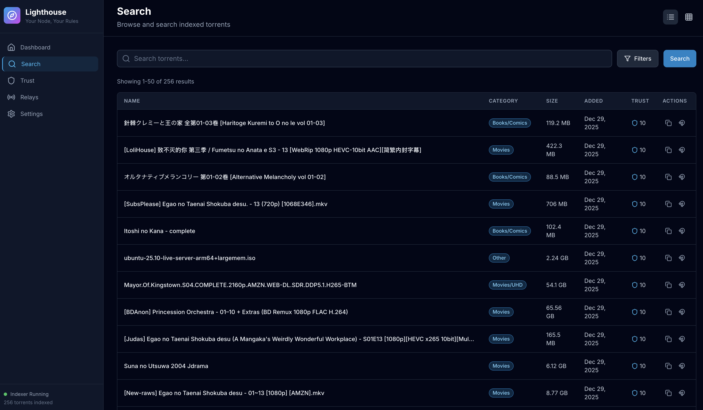
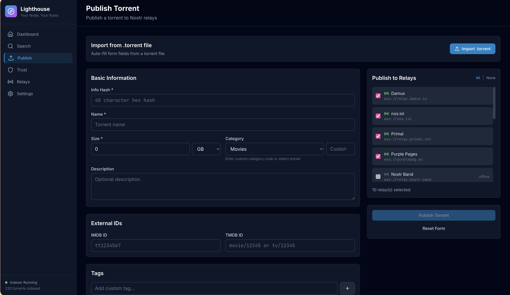
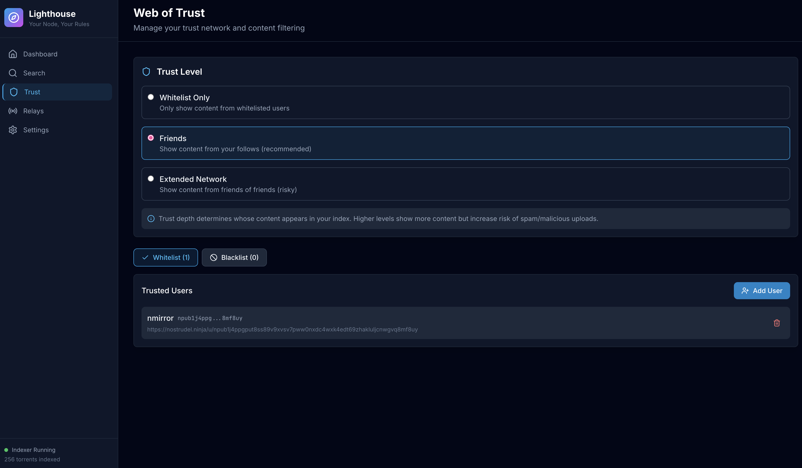
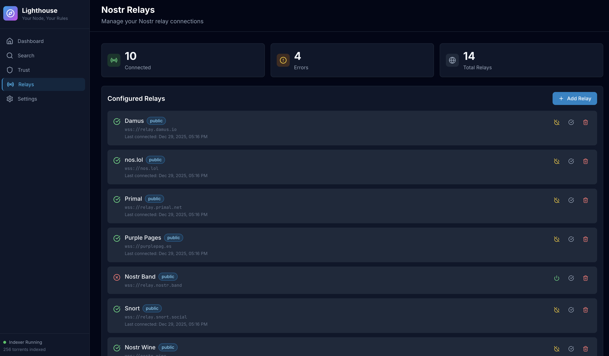
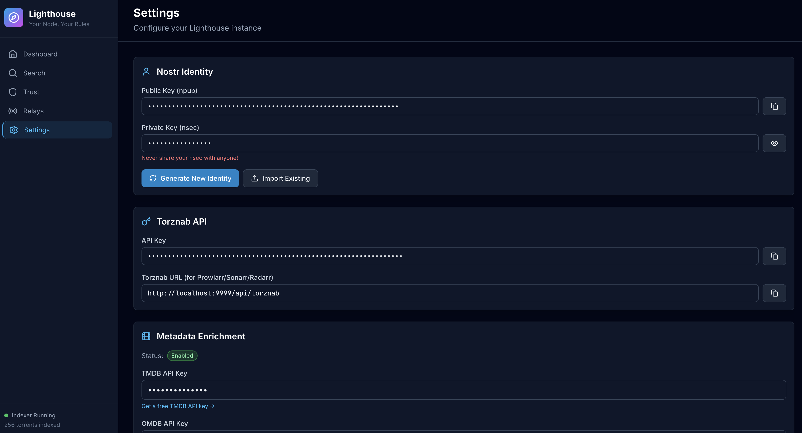

# Lighthouse

Self-hosted torrent indexer that pulls from the Nostr network. Comes with a Torznab API so it works with Prowlarr, Sonarr, Radarr, and other *arr apps.

## What it does

- Indexes torrents published on Nostr (NIP-35 / Kind 2003 events)
- Publish torrents to Nostr relays (import from .torrent file or manual entry)
- Filter what is indexed based on tags
- Web of Trust filtering - only see content from people you trust
- Torznab API for seamless *arr apps integration
- Auto-fetches posters and metadata from TMDB/OMDB
- Single Go binary + SQLite, runs anywhere
- Web UI built with Svelte

## Screenshots

<p>

</p>
<p>


</p>
<p>


</p>
<p>


</p>
<p>

</p>

## Quick start

### From source (recommended)

Needs Go 1.22+ and Node.js 20+

```bash
git clone https://github.com/gmonarque/lighthouse.git
cd lighthouse
make build
./lighthouse
```

### Docker 

```bash
git clone https://github.com/gmonarque/lighthouse.git
cd lighthouse
docker-compose up -d
```

Open http://localhost:9999

## Configuration

Lighthouse uses `config.yaml`. A default one is created on first run:

```yaml
server:
  host: "0.0.0.0"
  port: 9999
  api_key: ""  # auto-generated

database:
  path: "./data/lighthouse.db"

nostr:
  identity:
    npub: ""
    nsec: ""
  relays:
    - url: "wss://relay.damus.io"
      enabled: true

trust:
  depth: 1  # 0=whitelist only, 1=follows, 2=follows of follows

enrichment:
  tmdb_api_key: ""
  omdb_api_key: ""
  enabled: true
```

### Environment variables

Override any setting with `LIGHTHOUSE_` prefix:

```bash
LIGHTHOUSE_SERVER_PORT=8080
LIGHTHOUSE_ENRICHMENT_TMDB_API_KEY=your_key
```

## Using with *arr apps

1. Complete the setup wizard at http://localhost:9999
2. Go to Settings and copy your API key
3. In Prowlarr/Sonarr/Radarr, add a new indexer:
   - Type: Torznab
   - URL: `http://localhost:9999/api/torznab`
   - API Key: paste from step 2
4. Test and save

## Web of Trust

Controls what content shows up based on who uploaded it:

| Depth | What you see |
|-------|--------------|
| 0 | Only whitelisted uploaders |
| 1 | Whitelist + people you follow on Nostr |
| 2 | Above + friends of friends (use carefully) |

From the Trust page you can:
- **Whitelist**: manually add trusted uploaders by npub
- **Blacklist**: block bad actors (removes all their torrents)
- **Import follows**: pull your Nostr contact list

## Categories

Full Torznab category support with subcategories:

- **Movies**: Foreign, SD, HD, UHD/4K, 3D, BluRay, DVD, WEB-DL
- **TV**: SD, HD, UHD, WEB-DL, Anime, Documentary, Sport
- **Audio**: MP3, Lossless, Audiobook
- **PC**: Games, Software, Mac, iOS, Android
- **Books**: EBook, Comics, Magazines, Technical
- **Console**: Various platforms
- **XXX**: Adult content (filterable)

## API Reference

### REST API

| Endpoint | Method | Description |
|----------|--------|-------------|
| `/api/stats` | GET | Dashboard statistics |
| `/api/search` | GET | Search torrents |
| `/api/torrents/:id` | GET | Torrent details |
| `/api/torrents/:id` | DELETE | Remove torrent |
| `/api/publish/parse-torrent` | POST | Parse .torrent file |
| `/api/publish` | POST | Publish torrent to relays |
| `/api/trust/whitelist` | GET/POST/DELETE | Manage whitelist |
| `/api/trust/blacklist` | GET/POST/DELETE | Manage blacklist |
| `/api/relays` | GET/POST/PUT/DELETE | Manage relays |
| `/api/settings` | GET/PUT | App settings |
| `/api/indexer/start` | POST | Start indexer |
| `/api/indexer/stop` | POST | Stop indexer |

### Torznab API

| Endpoint | Parameters | Description |
|----------|------------|-------------|
| `/api/torznab?t=caps` | - | Capabilities |
| `/api/torznab?t=search` | q, cat, limit | General search |
| `/api/torznab?t=tvsearch` | q, season, ep | TV search |
| `/api/torznab?t=movie` | q, imdbid, tmdbid | Movie search |

## Project structure

```
lighthouse/
├── cmd/lighthouse/        # entry point
├── internal/
│   ├── api/              # HTTP handlers & router
│   ├── config/           # configuration
│   ├── database/         # SQLite & migrations
│   ├── indexer/          # torrent indexing
│   ├── nostr/            # Nostr client & events
│   ├── torznab/          # Torznab protocol
│   └── trust/            # Web of Trust
├── web/                  # Svelte frontend
└── docker/               # Docker stuff
```

## Development

```bash
make deps          # install dependencies
make dev           # backend with hot reload
make dev-frontend  # frontend dev server (separate terminal)
make test          # run tests
make build         # production build
make docker        # build docker image
```

## 🔗 Links

- [NIP-35 spec](https://github.com/nostr-protocol/nips/blob/master/35.md) - Nostr torrent protocol
- [go-nostr](https://github.com/nbd-wtf/go-nostr) - Nostr library used

## License

MIT
